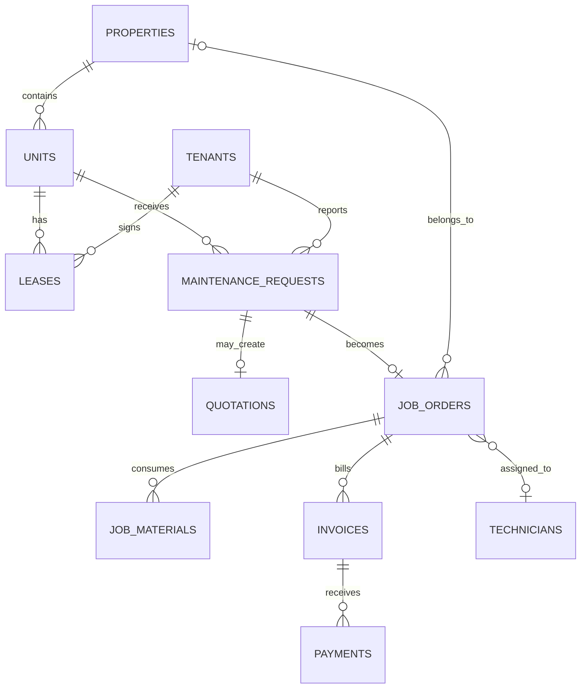

# Starter Data Model

## Core relationships

## Design decisions

- Use one `people` table for tenants, owners, customers and contacts only if the implementation team is comfortable with polymorphic roles. For the first version, separate tables are easier to understand and report on.
- A maintenance request is the customer/property-facing issue. A job order is the operational work execution record.
- An invoice may belong to a job order, lease, or another billable source through a typed `billable_type` and `billable_id`, but the MVP can start with job invoices only.
- Store money as decimal values with a currency code. Never infer currency from a label.
- Store all uploaded evidence in a `documents` table with owner type/id, category, file path and visibility.

## Main entities

`users`, `roles`, `properties`, `property_units`, `tenants`, `leases`, `maintenance_requests`, `service_catalog`, `quotations`, `job_orders`, `technicians`, `vendors`, `inventory_items`, `stock_movements`, `invoices`, `payments`, `expenses`, `documents`, `inspections`, `crm_interactions`, `notifications`, `audit_logs`.
