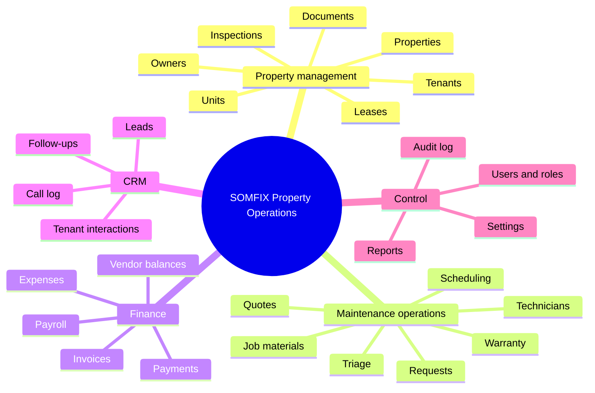
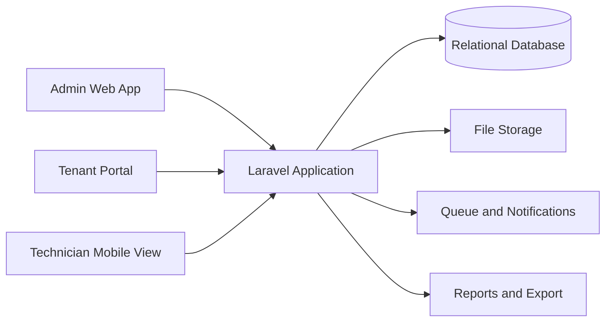
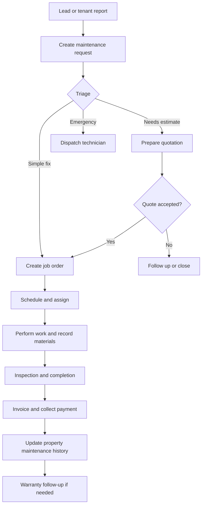

# SOMFIX Property & Maintenance Operations — System Architecture

## 1. System overview

SOMFIX should be designed as a multi-module operations system for property owners, property managers, tenants and repair teams in Mogadishu. The two supplied workbooks are complementary rather than separate products:

- `Property_Management_CRM`: property, unit, tenant, lease, maintenance and CRM records.
- `SOMFIX_ERP_Columns`: customer intake, service catalog, quotations, job orders, materials, inventory, suppliers, purchasing, billing, payments, expenses, payroll and warranty tickets.

The core integration is:

`Property → Unit → Tenant/Lease → Maintenance Request → Job Order → Quote/Invoice → Payment → Maintenance History`

## 2. Mind-map view

## 3. Main architecture flow

## 4. Business workflow

## 5. Modules

### A. Dashboard

Show operational numbers rather than only finance:

- Properties and units
- Occupied, vacant and under-maintenance units
- Open maintenance requests by priority
- Jobs scheduled today
- Overdue leases and unpaid invoices
- Revenue, expenses and estimated profit
- Stock items at reorder level

### B. Property registry

Property ID, property name, owner, address/location, district, city, property type, photos, rooms/units, facilities, documents, inspection reports and notes.

### C. Unit and tenancy management

Unit number, bedrooms, bathrooms, floor, size, market rent, status, current tenant, lease history, payment terms, deposit, move-in/out dates and documents.

### D. Tenant and CRM

Tenant profile, phone, WhatsApp, email, preferred contact method, lead source, interactions, complaints, follow-ups, satisfaction and communication history.

### E. Maintenance and field service

Request category, description, photos, priority, status, assigned vendor/technician, estimate, approval, schedule, job status, labor, materials, transport, completion evidence, customer rating and warranty.

### F. Finance

Invoices, partial payments, payment methods used in Somalia, expenses, vendor balances, payroll, rent-related transactions and profit by job/property.

### G. Inventory and purchasing

Items, units, opening stock, purchases, usage on jobs, on-hand quantity, reorder level, suppliers and purchase payment status.

## 6. Roles and permissions

| Role                   | Main access                                                            |
| ---------------------- | ---------------------------------------------------------------------- |
| System Admin           | Everything, settings, users, audit logs                                |
| Property Manager       | Properties, units, tenants, leases, maintenance, reports               |
| Operations Coordinator | Leads, requests, quotes, scheduling, job orders                        |
| Accountant             | Invoices, payments, expenses, payroll, financial reports               |
| Technician             | Assigned jobs, schedule, work notes, materials, photos, status updates |
| Vendor                 | Assigned work orders, estimates, completion evidence                   |
| Tenant                 | Own unit, lease summary, maintenance requests, request status          |
| Viewer/Owner           | Read-only property and financial summaries                             |

## 7. Non-functional requirements

- Mobile-first technician and tenant screens.
- Somali and English labels from the beginning. Arabic can be added later.
- Store phone numbers as text and support WhatsApp links.
- Keep USD and SOS as supported currencies, with currency recorded per transaction.
- Every important change should record user, time and before/after values.
- Do not delete financial or lease history. Use archive/status fields.
- Compress uploaded images and keep originals in private storage.
- Use policy-based authorization, server-side validation and signed document URLs.
